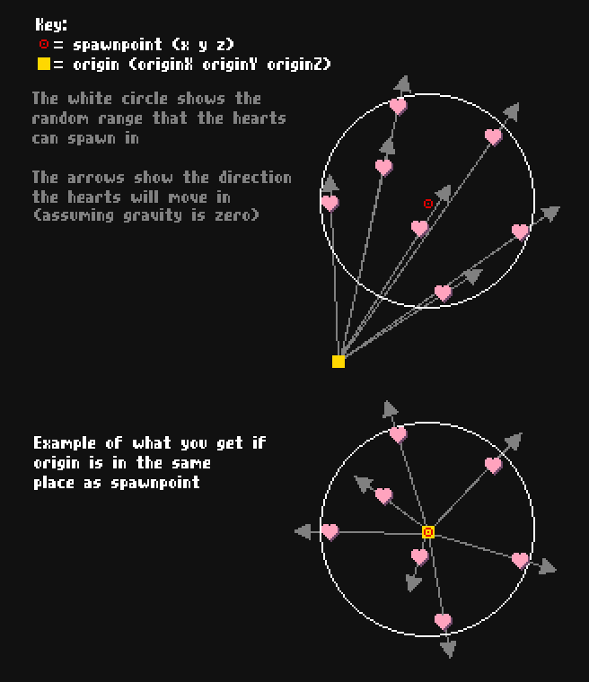

# GoodlyEffects
Adds support for CustomParticles CPE

#### Commands 
- /Effect is for spawning one-time effects.
- /Spawner is for managing persistent particle "spawners", which spawn particles at a given rate.
- /ReloadEffects refreshes all effects. Useful when you modify or add new effect config files and don't want to reload the entire plugin.
- Please use /help [command] for details on usage. **READ CAREFULLY.**

If you're still confused about what origin does in the spawner arguments, see the infographic below:

### Defining your own effects

To define your own effects, you need to put special .properties files inside the folder named "effects." You should see this folder appear if you've loaded the plugin on your server.

You can find an example heart.properties file [here](examples/heart.properties).

Open this file with a text editor and view its contents for an explanation of each property.

The name of the file determines the name of the effect in-game.

You will also need a texture pack that includes a custom particles.png if you want to see any custom graphics for your particles.

You can find an example particles.png file [here](examples/particles.png). This image includes the heart that the aforementioned heart.properties file defines.